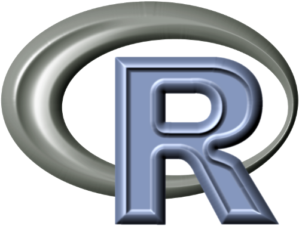
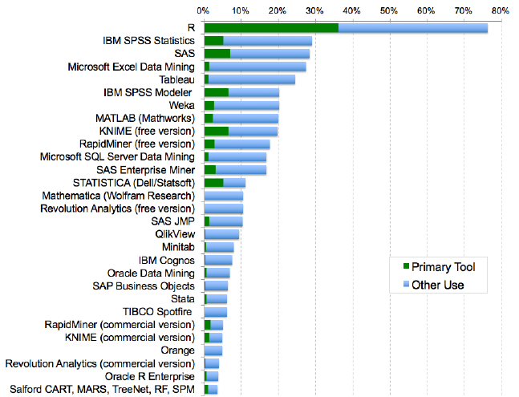
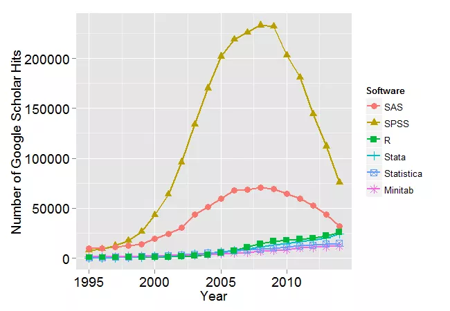

--- &twocol 

## I Very Brief History Of R  

*** {name: left}

- **_S_ language (1976)**
  - Developed in Bell Labs
  - An Alternative to **_Fortran_** Routines
  
   
  
- **_R_ Language**
  - Derived from **_S_** and **_Scheme_** (1993)
  - Open Source under the Free Software Foundation's GNU general license (1995)

*** {name: right}

  

--- &twocol .twocol

## Usage and Interest is Steadily Increasing

 
 
*** {name: left}
  
  Reported R use in survey.
  
  

*** {name: right}
  
  Interest in popular packages over time.
   
  

---

## Why Use R?

- It's FREE!
- Built by statisticians
- Excellent Visualizations
- Strong Documentation (Usually)
- Good For Reproducibility
- Large Active Community of Users

---

## Goals and Objectives

- Learn basics of R programming
- Get Familiar with R Studio
- Create a script
- Develop a good workflow
- Do A Basic Analysis
- Create A Basic Visualization
- Get More Fancy (Time allowing)

